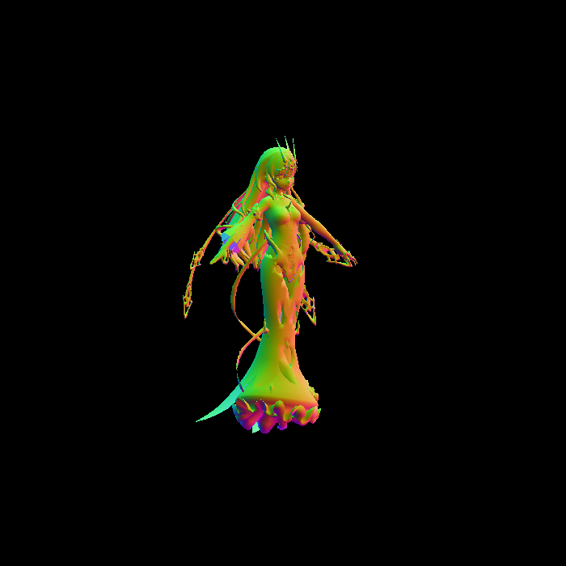

Checklist

> 框架里确实有很多奇怪的地方，例如透视投影的插值矫正鸭什么的。。。
> 理解课上讲的这些知识就好，不必死扣代码细节。。。

## Bonus 1

- bunny normal

> 需要给一个颜色图片，将hmap复制到Hw3/models/bunny文件夹内
>
> 摄像机离太远了，可以将eye_pos设置为(0, 0, 1.5)

- crate texture

  

> [渲染缺面的原因及解决方法](http://games-cn.org/forums/topic/%e4%bd%9c%e4%b8%9a3%e6%8d%a2%e6%a8%a1%e5%9e%8b-crate%e5%87%ba%e5%a4%a7%e9%97%ae%e9%a2%98/)

- cube texture

- rock texture

> 摄像机离太近了，导致rock的bounding值超过了700*700的像素
>
> 将eye_pos设置为(0, 0, 20)可以避免段错误

- Mobius[彩蛋]

> 梅比乌斯。贴图有很多张，框架里texture应该只能读一张，就只渲染了normal

## Bonus 2

