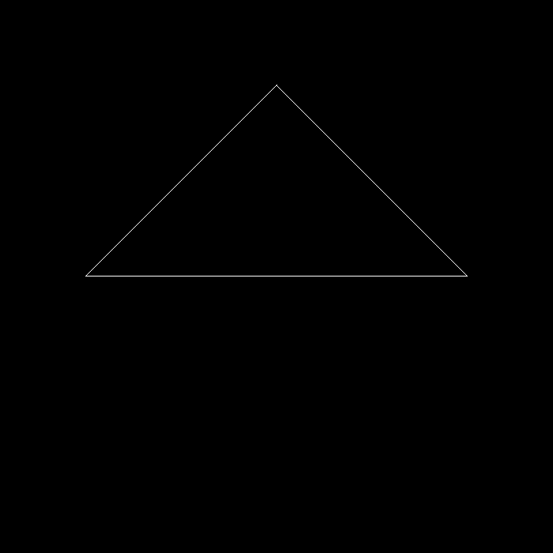
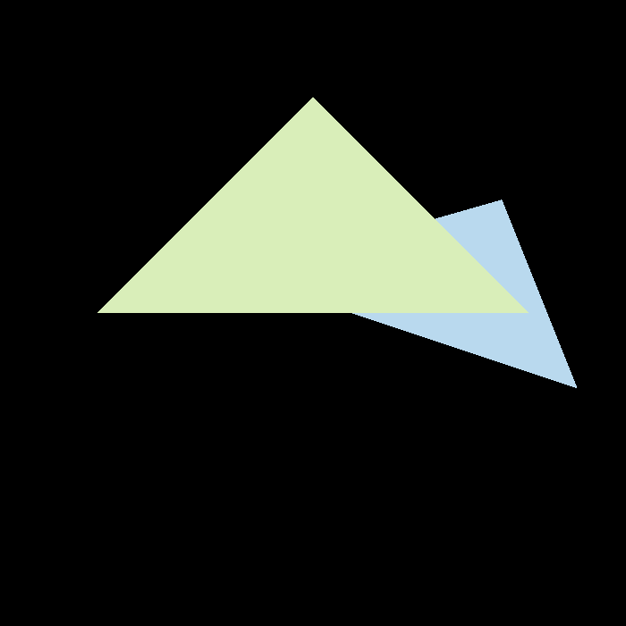

# GAMES101   
仅供参考！如果你真的热爱图形学，希望可以自己先尝试写作业！
直接看代码是收获不到知识的！

Table of Contents
=================

<!--ts-->
  * [作业目录](# Table of Contents)
  * [参考作业实现](# 参考作业实现)
        * [作业0](# 作业0 环境配置)
        * [作业1](# 作业2 Triangles and Z-buffering)
        * [作业2](# 作业3 Pipeline and Shading)
              * [Normal](# Normal)
              * [MSAA 4X](# MSAA 4X)
        * [作业3](# 作业3 Pipeline and Shading)
              * [基础要求实现](# normal)
              * [Bonus](# Bonus1 Other models)
<!--te-->

# 参考作业实现

## 作业0 环境配置
- OS: Arch Linux x86_64
- kernel: latest
- editor: neovim
- compiler: clang/gcc
- lib: eigen

用虚拟机太麻烦了，自己装个eigen、opencv库就好了

Arch下eigen、opencv安装: ```sudo pacman -Sy eigen opencv```

正如老师第一节课中说的，还是推荐大家用ide

~~我用vim只是因为我有很多插件用习惯了, 顺手......~~

VIM如果使用clangd插件发现补全因为找不到头文件出错，可以尝试以下两种方法之一：

- 添加compile_flags.txt文件。告诉clangd编译参数，就像下面这样写入

```txt
-xc++
-I
/usr/include/opencv4/
-O3
-std=c++17
```

- 添加compile_commands.json文件。该文件可以在CMakeLists.txt中添加以下参数自动生成

```txt
set(CMAKE_EXPORT_COMPILE_COMMANDS ON)
```

其他VIM插件的介绍与该项目无关，可以参考我的[dotfiles](https://github.com/horel/dotfiles/tree/master/.config/nvim)


## 作业1 旋转与投影



## 作业2 Triangles and Z-buffering

### Normal



### MSAA 4X


> 可以看到开启MSAA 4X后，锯齿感降低很多。同时增加以下部分，消除了交界处的黑边bug：
>
> - depth_buf_msaa2x2: depth buffer for MSAA
> - mix_pixel(): added for MSAA

## 作业3 Pipeline and Shading

### normal


### phong


### texture


### bump


### displacement


### Bonus1 Other models

> 详细问题请查看[CheckList](Hw3/README.md)

- bunny


- Crate


- cube


- rock


- Mobius[彩蛋]


> 梅比乌斯。贴图有很多张，框架里texture应该只能读一张，就只渲染了normal

### Bonus2 Bilinear
